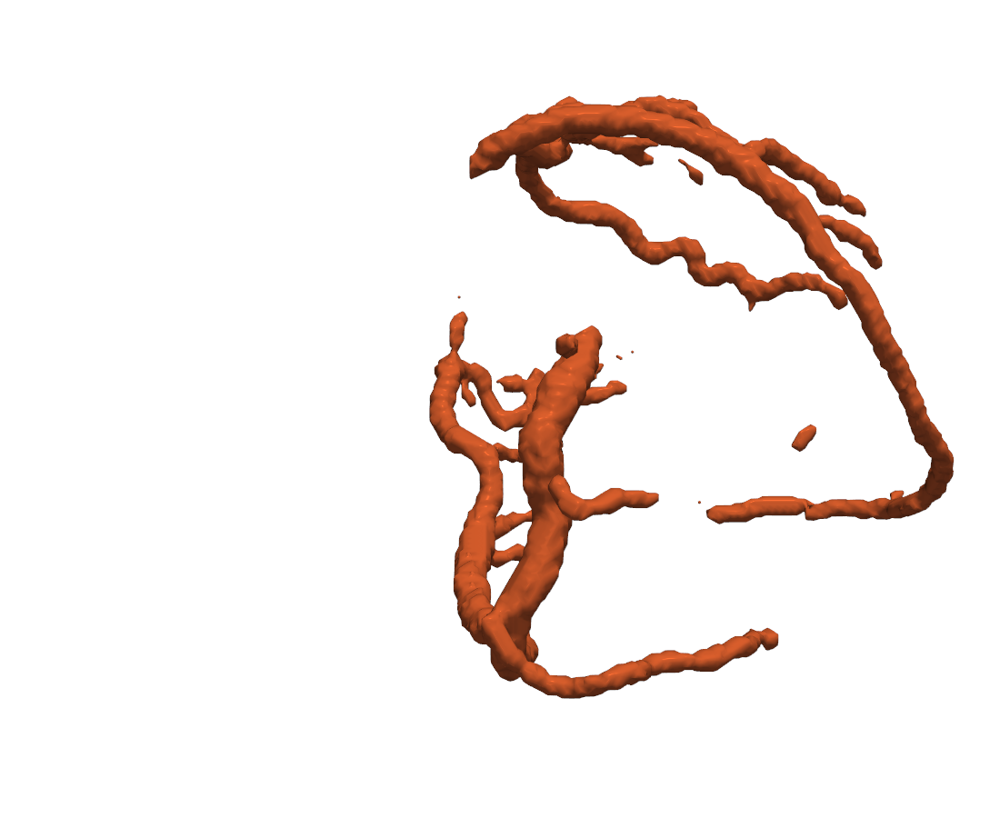
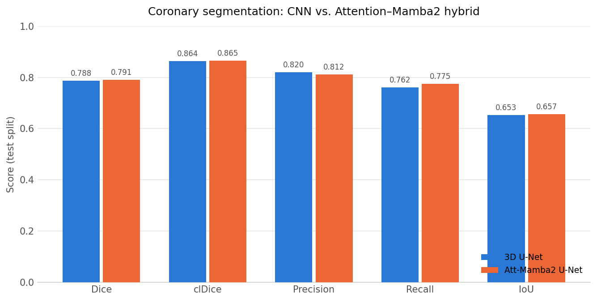

# Coronary Artery Segmentation from 3D CTA — A CNN vs. State-Space Architecture Study

Coronary Artery Disease (CAD) remains the leading cause of death globally. This project studies **voxel-wise binary segmentation of the coronary artery tree from 3D CTA volumes**, comparing a strong convolutional baseline against a hybrid encoder that adds Mamba-2 state-space blocks and attention. The goal is not a leaderboard number but a controlled comparison: *does replacing convolutions with state-space sequence modeling change segmentation quality or training cost on this task?*

<p align="center">
  
</p>
<p align="center"><em>Predicted coronary artery tree (surface render of a model output mask).</em></p>

Two architectures are implemented behind a shared data, training, and evaluation harness so the only variable is the encoder:

- **3D U-Net** — a MONAI-based convolutional baseline (~31M params, 1 input channel: CT).
- **Attention–Mamba2 U-Net** — a hybrid encoder combining multi-layer conv (MLC) stems, Mamba-2 state-space blocks, and windowed/global attention (~31M params, 2 input channels: CT + Frangi vesselness). A stride-2 stem shrinks the volume 8× before the attention stages, keeping cost low.

## Finding: parity in quality, and the hybrid trains faster

Both models were trained under identical settings — AdamW (lr 1e-4, weight decay 1e-4, 5-epoch warmup), 100 epochs, 96³ patches, 4 patches sampled per volume — and evaluated on a held-out test split. clDice is a topology-aware score that penalizes centerline breaks in thin tubular structures.



| Model | Params | Dice | clDice | Precision | Recall | IoU | Time/Epoch |
|---|---|---|---|---|---|---|---|
| 3D U-Net | ~31M | 0.788 | 0.864 | **0.820** | 0.762 | 0.653 | ~1.7 min |
| Att-Mamba2 U-Net | ~31M | **0.791** | **0.865** | 0.812 | **0.775** | **0.657** | **~1 min** |

The two encoders land within ~0.003 Dice of each other — **essentially parity in segmentation quality.** The interesting result is on the cost axis: the state-space hybrid reaches the same quality at roughly **half the per-epoch time**, because the stride-2 stem plus Mamba-2's linear-complexity sequence modeling avoids the quadratic cost that a pure-attention encoder would pay at 96³. The baseline holds a small precision edge; the hybrid a small recall edge — a bias/variance trade rather than a clear winner.

> **Takeaway:** on coronary CTA segmentation, swapping a convolutional encoder for a Mamba-2/attention hybrid did **not** move accuracy, but did cut training cost — a useful negative/efficiency result rather than a new SOTA claim.

## Repository Structure

```
configs/          # YAML training configs (unet_baseline, att_mamba2_unet)
src/
  data/           # Dataset classes and preprocessing transforms (incl. Frangi vesselness)
  models/
    segmentation/ # baseline_unet, att_mamba2_net
    model_factory.py
  losses/         # SoftCLDiceLoss, combined DiceCE + clDice loss
  metrics/        # clDice metric
  visualization/  # Evaluation, report generation, 3D volume rendering
  train.py        # Segmentation training entry point
scripts/          # Inference, 3D evaluation, postprocessing tuning, dataset analysis
notebooks/        # Exploratory data analysis and preprocessing tests
docs/             # Inference and visualization guides
```

## Quick Start

### Setup

```bash
python -m venv mip_env && source mip_env/bin/activate
pip install -r requirements.txt
```

Key dependencies: PyTorch ≥2.0, MONAI, mamba-ssm, scikit-image (Frangi vesselness), plotly/pyvista (visualization).

### Data

Developed against the public **[ImageCAS](https://github.com/XiaoweiXu/ImageCAS-A-Large-Scale-Dataset-and-Benchmark-for-Coronary-Artery-Segmentation-based-on-CT)** coronary CTA dataset. The dataset is not redistributed here — bring your own cases in this format under the `data_dir` set in the config (default `./data/imagecas`):

- `*.img.nii.gz` — CT volume (3D)
- `*.label.nii.gz` — Binary segmentation ground truth

The dataset loader also supports a directory-per-case layout; see `src/data/dataset.py`.

### Pretrained weights

Trained checkpoints for both models are hosted on the Hugging Face Hub (see the model card for metrics, usage, and limitations):

```python
from huggingface_hub import hf_hub_download
ckpt = hf_hub_download("noahschuetz/coronary-segmentation", "att_mamba2_unet.pth")
```

> Replace the repo id with your Hugging Face namespace once uploaded (see `docs/MODEL_CARD.md`).

### Training

```bash
# Proposed Att-Mamba2 U-Net (2 input channels: CT + Frangi vesselness)
python src/train.py --config configs/att_mamba2_unet.yaml

# 3D U-Net baseline (CT only)
python src/train.py --config configs/unet_baseline.yaml
```

Checkpoints, a config snapshot, and TensorBoard logs are written to `results/{experiment_name}/`.

### Inference

```bash
python scripts/inference.py \
    --results_dir results/att_mamba2_unet_baseline \
    --input_dir ./data/test_images \
    --output_dir ./predictions
```

### Evaluation

```bash
# Full 3D evaluation (Dice, HD95, clDice, Precision, Recall, F1, IoU)
python scripts/evaluate_3d.py \
    --predictions ./predictions \
    --ground_truth ./data/raw \
    --output_dir ./evaluation

# Sweep postprocessing hyperparameters (threshold, min component size, top-k)
python scripts/tune_postprocessing_and_eval.py \
    --config configs/att_mamba2_unet.yaml
```

## Method Overview

```
CT Volume (NIfTI)
  → Preprocessing: reorient → resample → HU window → normalize → [Frangi vesselness channel]
  → 96³ patch sampling
  → Segmentation model
       U-Net              (MONAI 3D U-Net)
       Att-Mamba2 U-Net   (stride-2 stem → MLC → MAM + windowed attn → MAM + global attn)
  → Voxel probability map → threshold → connected-component postprocessing
  → Binary coronary mask
```

## Documentation

| File | Description |
|---|---|
| [docs/MODEL_CARD.md](docs/MODEL_CARD.md) | Hugging Face model card (metrics, usage, limitations) |
| [docs/readme_inference.md](docs/readme_inference.md) | Inference guide |
| [docs/visualization_usage.md](docs/visualization_usage.md) | Visualization guide |

Regenerate the README figures at any time with `python scripts/make_readme_figures.py`.

## Acknowledgements

Developed as a research project in collaboration with the **Institute for Cardiovascular Computer-Assisted Medicine (ICM)** at **Charité – Universitätsmedizin Berlin** and **TU Berlin**. Thanks to Dikshyant Acharya for the collaboration, and to Prof. Dr.-Ing. Anja Hennemuth, head of the *Digital Image Analysis & Modeling* research area, for guidance and supervision.

## License

See [LICENSE](LICENSE).
